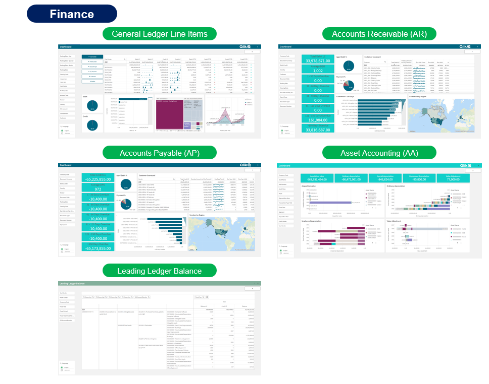

# Qlik SAP Accelerator Packages for QDI
Qlik SAP Accelerator Packages for QDI are the pre-configured solution templates which address the entire data supply chain for SAP data, from real-time ingestion and automated transformation through the delivery of analytics-ready data and BI dashboards. 

Qlik SAP Accelerator Packages include the following 4 scenarios: "**Finance**", "**Order to Cash**", "**Procure to Pay**" and "**Inventory**".

For more information on the visualizations and data marts to be deployed by this package, please refer to the following documents
* **SAP Accelerator Packages Overview** ([English](./Documentations/SAP_Accelerator_Packages_Overview_EN.pdf) | [Japanese](./Documentations/SAP_Accelerator_Packages_Overview_日本語.pdf))

## Prerequisites
* Build upon **Qlik Replicate**, **Qlik Compose** and **Qlik Sense**
* Tested with **SAP ECC 6.0** and **SAP S/4 HANA** as data sources
	* **SAP ODP** is used for data extraction
* Tested with **Microsoft SQL Server**, **Microsoft Synapse**, **Snowflake**, **Google BigQuery** and **AWS Redshift**
	* Note that the Qlik Sense Apps included in these Packages are not compatible with Redshift, only Replicate tasks and Compose projects work on Redshift.
	
## Setup
Follow the setup procedures contained in the POC Guide below:

* **SAP Accelerator Packages POC Guide** ([English](./Documentations/SAP_Accelerator_Packages_POC_Guide_EN_v3.3.pdf) | [Japanese](./Documentations/SAP_Accelerator_Packages_POC_Guide_日本語_v3.3.pdf))
* **Data Source List** ([English](./Documentations/Data_Source_List_EN_v3.3.xlsx) | [Japanese](./Documentations/Data_Source_List_日本語_v3.3.xlsx))

## Author
**Masaki Hamano**
* https://github.com/mhamano/

## Change Log
See [Releases](https://github.com/qlik-japan-presales/Qlik_SAP_Accelerators_For_QDI/releases).
